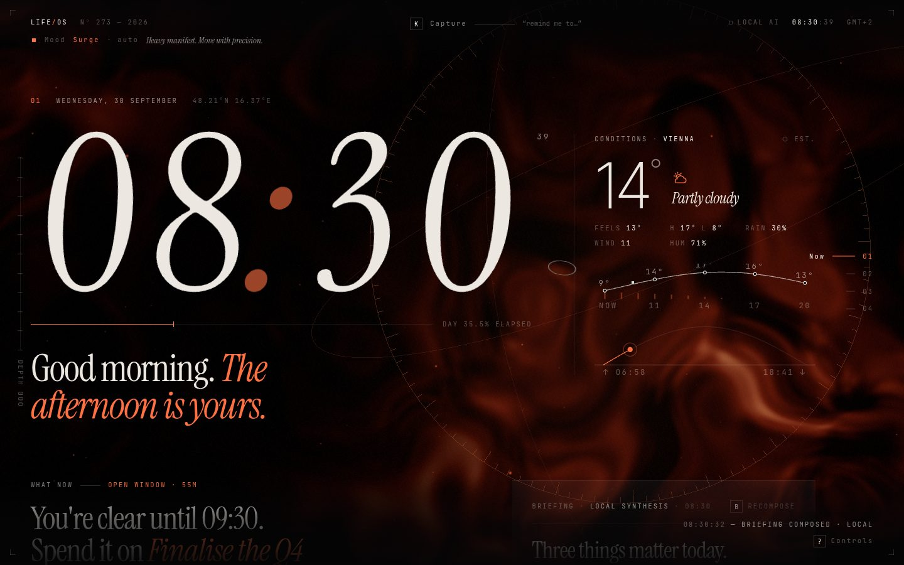
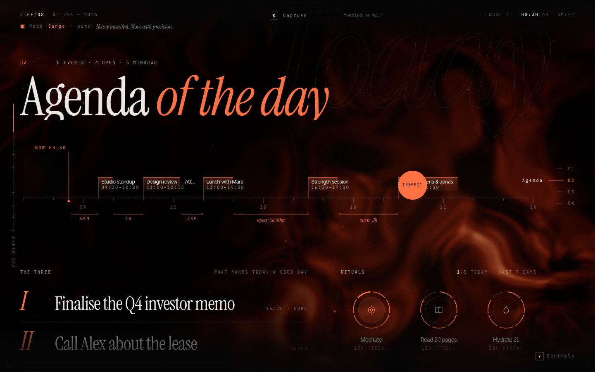
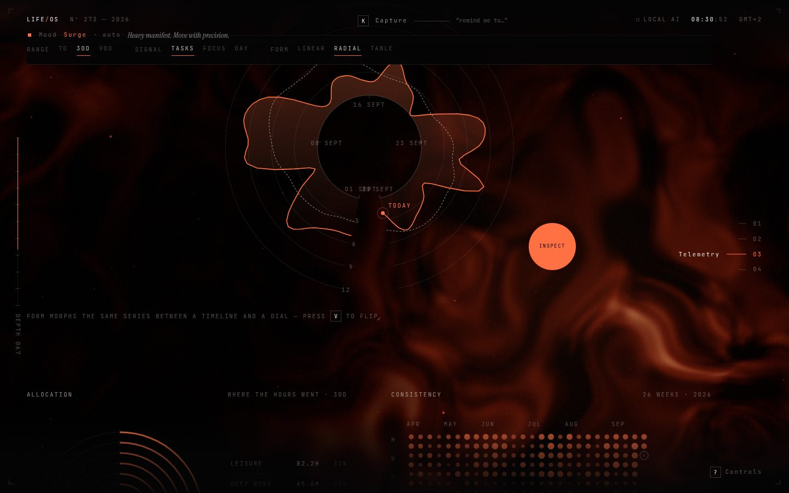
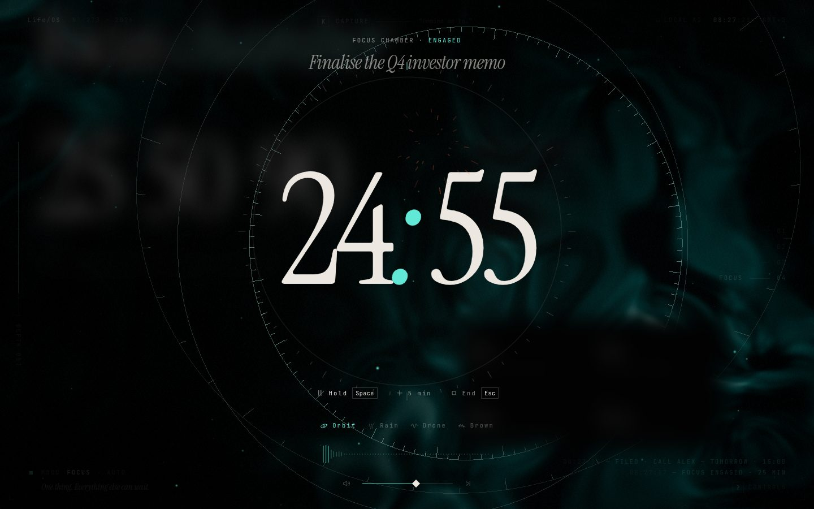
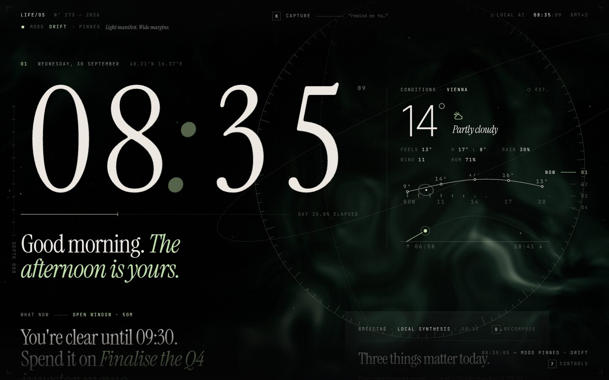

# Life/OS — a personal command center

A personal operating system that feels like the control room of a spacecraft, re-cut by a luxury fashion house.
An almost-black canvas, monumental serif typography, a living WebGL field that changes with your state, and
information laid out spatially — a time ribbon, a dial, an orbit — instead of dashboard cards.



| | |
| --- | --- |
|  |  |
|  |  |

```
01 Now        the time, the sky, what to do next, and a briefing written for today
02 Agenda     the day as an instrument: time ribbon, the three priorities, rituals, the manifest
03 Telemetry  streaks, trends and where the hours went — charts that morph between forms
04 Focus      a chamber: countdown dial, live-synthesised soundscapes, session logging
```

## What it does

| Area | Details |
| --- | --- |
| **Today** | Horizontal day ribbon with a live *now* needle, hatched elapsed time, lane-packed events and labelled open windows. "The three" priorities (struck through by hand on completion), rituals as 7-day orbit rings, and a drag-to-reorder task manifest with filters and undo. |
| **Stats** | Momentum streak, completions, focus hours and ritual rate with period-over-period deltas; a trend chart that **rolls** from a timeline into a clockwise dial (curvature morph — the baseline bends into a circle, values stay on the local normal) or flips to a table; concentric allocation rings; a 26-week consistency star chart. |
| **Context** | Local time, Open-Meteo weather (no key), hourly strip, sunrise→sunset arc, and a *what should I do now?* directive engine (free windows, next event, overdue work, streaks at stake, weather). |
| **Focus mode** | Full-screen chamber: the scene retunes to the Focus mood, the 3D rings become the clock face, soundscapes (Orbit / Rain / Drone / Brown) are synthesised live with Web Audio — play/pause, next, volume and a spectrum visualiser. Sessions feed the stats. |
| **Quick capture** | `K` opens a natural-language command line — *"remind me to call Alex tomorrow at 3"*. A local parser previews tokens as you type; on Enter, **Claude** interprets it into a task / event / habit via structured output. |
| **AI briefing** | A local synthesis appears instantly and is upgraded to a Claude-written briefing: headline, 2–3 grounded paragraphs, the best focus window, and the next move. |
| **Mood engine** | Load (open priorities, overdue work, remaining events) and the hour pick one of *Drift · Flow · Surge · Focus · Nocturne*. Mood drives the shader palette, particle tempo, UI accent and the copy — tweened, never cut. Pin one with `M`. |
| **Vibe** | Cursor-velocity reactive everything: the field refracts around the pointer, particles scatter, headlines skew, the reticle cursor stretches along its velocity vector. Spring physics, magnetic controls, spark bursts, tiny synthesised ticks and chimes, smooth inertial scrolling. |

## Keyboard

| Key | Action | Key | Action |
| --- | --- | --- | --- |
| `K` / `⌘K` / `/` | Capture | `N` | Another suggestion |
| `F` | Enter focus (25 min, top task) | `B` | Recompose briefing |
| `Space` | Hold / resume focus | `V` | Morph the chart |
| `Esc` | Close · leave focus | `M` | Cycle mood (auto → pinned) |
| `1`–`4` | Jump to section | `S` | Sound effects on/off |
| `Z` / `⌘Z` | Undo | `?` | Controls & settings |
| `T` | **Lab** — display switches & feature tests | `E` | **Planner** — plain add/edit view |
| `G` | **Monitor mode** (second screen) | | |

### Planner (`E`)

A calm, legible full-screen editor for when the cinematic view is too much: quick-add in plain language, forms and
inline editing for tasks, events and habits (tick any of the last seven days), plus a **Data** tab with export/import
backups, *Reset demo* and **Clear all data** (two-step confirm; display settings are kept).

### Monitor mode (`G`)

A glanceable, no-scroll layout for a second screen: huge clock and date, weather, *now / next / later*, the rest of
the day as a timeline, the three priorities, rituals and a rotating "what now" suggestion. A running focus session
takes over the right column. A toolbar (fades when the mouse rests) offers Bright / Dim / Night, seconds on/off,
background effects on/off, **Keep awake** (Screen Wake Lock), fullscreen, capture and the planner. The layout drifts a
few pixels each minute to spare OLED panels. Open **`/?monitor`** to land in it directly — bookmark that on the second
screen. Tabs stay in sync, so anything you change on your main screen appears on the monitor within a moment.

### Display switches (Lab → Display & features)

Turn individual pieces on or off — animated background, particles, 3D rings, calm motion, custom cursor, boot intro,
outline words, sound effects, side rails, activity log — and hide whole sections (Now, Agenda, Telemetry, Focus).
Presets: *Everything*, *Performance* (no WebGL, calm motion) and *Minimal*. With all three WebGL layers off, no GPU
context is created at all.

Press `T` (or the **Lab** button, bottom right) to open the feature lab: switch moods, add or clear load,
file sample captures, start a 1-minute focus session or jump to its completion, play each soundscape,
fake clear/storm/snow weather, morph the chart, and fire spark bursts — all without touching real data
(lab tasks are tagged `#lab`, most changes undo with `Z`).

## Stack

| | Used for |
| --- | --- |
| **Next.js 16 · React 19 · TypeScript** | App Router; the experience is client-rendered (time, storage and GPU dependent); route handlers for AI |
| **React Three Fiber · Three.js · GLSL** | Domain-warped nebula field with a velocity-driven refractive lens, 2.4k shader particles, armillary rings |
| **GSAP** (+ ScrollTrigger, SplitText) | Boot sequence, masked line reveals, scroll-scrubbed parallax, count-ups, mood colour tweens |
| **Motion** | Springs, layout animations, reorder, digit rolls, presence transitions |
| **Lenis** | Inertial scrolling, synced to ScrollTrigger |
| **D3** | Scales, curves and arcs for every chart; morph geometry is custom |
| **Radix UI** | Dialog (capture, controls), Slider (volume) — accessible primitives under a custom skin |
| **Zustand** | Single persisted store (`localStorage`) with undo |
| **Tailwind v4** | Layout utilities; the look lives in tokens and a handful of components |
| **Supabase** (optional) | Anonymous auth + one JSON row per user + realtime cross-device sync |
| **Claude** (`@anthropic-ai/sdk`) | Capture interpretation and daily briefing (structured outputs) |

## Getting started

```bash
npm install
cp .env.example .env.local   # optional — everything works without keys
npm run dev                  # http://localhost:3000
```

Deploying: import the repo on Vercel — it is detected as Next.js and needs no build settings.

The first run seeds a realistic demo universe (six months of history, today's calendar, habits and tasks).
Reset it or start empty from the controls panel (`?`).

### Claude

Set `ANTHROPIC_API_KEY` (server-side only). The routes use `claude-opus-5-5` by default
(override with `ANTHROPIC_MODEL`) with:

- **Structured outputs** — Zod schemas via `betaZodOutputFormat`, so the capture result and briefing are always
  schema-valid JSON;
- **low effort** for latency on both routes;
- **server-side refusal fallback** (`fallbacks: "default"`, beta `server-side-fallback-2026-07-01`) so a
  safety-classifier decline is retried on the recommended fallback model instead of failing.

If Claude is not configured, unreachable, slow (>15 s for capture) or declines, the client silently falls back
to the local parser (`chrono-node` + heuristics) and the local briefing. What is sent: the capture text with
your local date/time, or a compact snapshot of today's open tasks, events, habits and weather for the briefing.

> The API routes are unauthenticated. Before deploying publicly, put them behind auth (or Vercel password
> protection) so strangers can't spend your API credit.

### Supabase (optional)

1. Run `supabase/migrations/0001_life_state.sql` in your project.
2. Enable **Anonymous sign-ins** (Authentication → Providers).
3. Set `NEXT_PUBLIC_SUPABASE_URL` and `NEXT_PUBLIC_SUPABASE_PUBLISHABLE_KEY` (or `…_ANON_KEY`).

The persisted slice of the store is mirrored to `life_state` (debounced) and realtime updates from other tabs
or devices are applied live; row-level security restricts each row to its owner. Without the env vars the app is
fully local.

## Architecture

```
src/
  app/
    api/capture/route.ts     Claude → structured task/event/habit
    api/briefing/route.ts    Claude → structured daily briefing
    api/status/route.ts      is AI configured? which model?
  components/
    LifeOS.tsx               orchestrator: runtimes, mood, weather, briefing, keyboard
    scene/                   R3F canvas + GLSL (field, particles, rings)
    hud/                     chrome, reticle cursor, boot sequence
    sections/                Now · Today (ribbon, three, rituals, ledger) · Stats · Focus
    charts/                  MorphChart (timeline ↔ dial), Allocation, Consistency
    overlays/                QuickCapture, FocusOverlay, Controls
  lib/
    store.ts                 Zustand store, persistence, undo, day rollover
    mood.ts · mood-live.ts   mood derivation · tweened live values for WebGL + CSS
    agenda.ts                free windows, ranking, the three, directive engine
    stats.ts                 day stats, streaks, scores
    parse-local.ts           offline natural-language parser
    audio.ts                 Web Audio soundscapes + UI sounds
    pointer.ts · scroll.ts   cursor velocity telemetry · Lenis/GSAP bridge
    sync.ts                  optional Supabase mirror
```

Accessibility: every action is keyboard reachable, dialogs are Radix, charts carry text alternatives and a
table form, focus rings follow the mood accent, and `prefers-reduced-motion` disables the boot sequence,
bursts and transitions.
